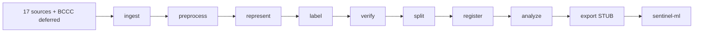

# Session 01 — Orientation: `data_module/` Big Picture

**Date:** 2026-06-13
**Session number:** 01 of 36
**Mode:** Awareness + Understand (orientation; no code read yet)
**Estimated study time:** 30 min teaching + 15 min Q&A
**Status:** 🟡 In progress — questions pending

---

## Why this session matters

Before reading a single line of `sentinel_data/*.py`, you need three
mental models in place: **(1)** the two `class_names()` orders and why
they diverge, **(2)** the 9-stage pipeline flow, and **(3)** the
three-layer configuration (config.yaml + dvc.yaml + pyproject.toml).
This session builds those mental models. Without them, every
later session will feel like decoding without a cipher.

## What you'll be able to do after this session

- Open any file in `sentinel_data/` and tell which **stage** it belongs
  to (1a/1b/2/3/4/5a/5b/6/7) from its package path.
- Tell which `class_names()` order to use for any piece of code that
  touches class **indices** (not names).
- Look at `config.yaml` and predict which thresholds will gate
  Run 10/11 acceptance.
- Trace data through the 9-stage DAG and predict what artifact exists
  at each stage's output dir.

## Sources read for this session

| File | Lines | Why we read it |
|------|-------|----------------|
| `data_module/README.md` | 291 | Package overview, status table, schema, taxonomy divergence |
| `data_module/config.yaml` | 384 | Runtime config; source list; friend-review rules |
| `data_module/dvc.yaml` | 82 | DAG definition |
| `data_module/pyproject.toml` | 60 | Package + dependency groups + CLI entry point |
| `data_module/docs/architecture.md` | 101 | Data flow + per-stage contracts + DAG + confidence tiers |
| `data_module/sentinel_data/__init__.py` | 57 | Package docstring + `__version__` |
| `data_module/sentinel_data/cli.py:1-120` | 120 | `sys.path` bootstrap + `STAGES` table + `STAGE_DESCRIPTIONS` |

**No source file was modified** (per global P19 — read-only source tree).

---

## §1 The Two-Taxonomy Divergence (FIRST concept, per module P102)

The `sentinel_data` codebase has **two** `class_names()` orders that
are **NOT the same**. They differ at three indices. Getting this wrong
silently corrupts every model checkpoint that depends on the index
alignment.

### The two orders

| Idx | Representation order | Labeling order |
|----:|----------------------|----------------|
| 0 | Reentrancy | CallToUnknown |
| 1 | CallToUnknown | DoS |
| 2 | Timestamp | ExternalBug |
| 3 | ExternalBug | GasException |
| 4 | GasException | IntegerUO |
| 5 | **DoS** ⇄ | **MishandledException** |
| 6 | IntegerUO | Reentrancy |
| 7 | UnusedReturn | Timestamp |
| 8 | **MishandledException** ⇄ | **TransactionOrderDependence** |
| 9 | **NonVulnerable** ⇄ | **UnusedReturn** |

**Sources:**
- Representation: `sentinel_data/representation/graph_schema.py:73-84`
- Labeling: `sentinel_data/labeling/schema/taxonomy.yaml`
- Cross-reference: `data_module/README.md:218-223`

### The 3 swap points (where they differ)

1. **Index 5** — `DoS` (rep) ⇄ `MishandledException` (labeling)
2. **Index 8** — `MishandledException` (rep) ⇄ `TransactionOrderDependence` (labeling)
3. **Index 9** — `NonVulnerable` (rep, a class slot) ⇄ `UnusedReturn` (labeling, a class slot). In labeling, NonVulnerable is a *negative* label (all-zeros across the 10-class one-hot), not a slot.

### Why they diverge

- **Representation order** is what the **Run 9 v11 model checkpoint**
  uses. The classifier head is `nn.Linear(256, 10)` with these 10
  output positions. Changing this order invalidates all existing
  checkpoints.
- **Labeling order** is the **v2 design intent** — alphabetical class
  list, `TransactionOrderDependence` added, `NonVulnerable` treated
  as a negative label rather than a class slot.

### The rule (per module P106)

> Anything that depends on **index alignment** with the model
> checkpoint must use the **representation order**. String-keyed
> lookups work either way.

### ADR status

An ADR for this divergence is needed but **not yet written** (per
`README.md:267`). It's an open item. When the ADR lands, it should
explain (a) which order is the source of truth for new code, (b) the
migration path if labeling becomes canonical, and (c) why the
divergence was tolerated during v2 build instead of forced to one
order.

---

## §2 The Package at a Glance (per global P5)

### One-sentence summary

`sentinel-data` is a 5-stage transformation pipeline
(`ingest → preprocess → represent → label → verify`) plus 3
cross-cutting support systems (`splitting`, `registry`, `analysis`)
plus 1 final stage (`export` — currently a **STUB**), that turns raw
Solidity from 17 curated corpora into model-ready training artifacts.

### Numbers (verified 2026-06-12 via `wc -l`)

| Metric | Value |
|--------|-------|
| Total LOC in `sentinel_data/` | 12,478 |
| Python files | 49 |
| Subpackages | 9 (ingestion, preprocessing, representation, labeling, verification, splitting, registry, analysis, export) |
| Entry point | `cli.py` (1,037 LOC) |
| Tests | ~94 + 2 integration |
| `cli.py` LOC per subcommand | 9 stages + 2 utilities |

### The one-way dependency rule (per `architecture.md:57-67`)

```
sentinel-ml (pyproject.toml)
  └── depends on sentinel-data ^0.1.0
sentinel-data (pyproject.toml)
  └── NO dependency on sentinel-ml
```

- ✅ `sentinel-data` is used by `sentinel-ml` (one direction)
- 🚫 `sentinel-data` **never** imports from `sentinel-ml`
- Enforced at install time: `poetry show --tree | grep -i sentinel-ml`
  in `data_module/` returns empty

**Why this matters:** keeps the data pipeline independently testable,
versionable, and reusable across training experiments. Bug fixes in
graph/token extraction logic live in `ml/`; the data module reads
those via thin-adapter files (covered in Session 12+).

### Why this package exists (from `README.md:6`)

> "the BCCC corpus that trained Runs 1–9 had 89.4% Reentrancy
> false-positives and 86.9% CallToUnknown false-positives — the model
> was learning label noise, not vulnerability patterns."

The data module is the structural defense against this failure mode.
Stages 3 (labeling) + 4 (verification) exist specifically to catch
bad labels before training.

---

## §3 The Pipeline Flow (DAG, per global P4)

### Linear DAG (from `dvc.yaml`)

```
ingest ─► preprocess ─► represent ─► label ─► verify ─►
         split ─► register ─► analyze ─► export ─► sentinel-ml
```

Each stage reads the previous stage's well-known output dir under
`data/` and writes its own. Re-running a stage re-runs only the
downstream stages (DVC caching).

### Mermaid (renders in GitHub / most MD viewers)



### Per-stage contract (from `architecture.md:25-35`)

| Stage | Input | Output | Sidecar |
|-------|-------|--------|---------|
| ingest | `config.yaml` enabled sources | `data/raw/<source>/*.sol` | `ingestion_manifest.json` (SHA-256) |
| preprocess | `data/raw/*.sol` | `data/preprocessed/<source>/<sha256>.sol` | `<sha256>.meta.json` |
| represent | `<sha256>.sol` + `<sha256>.meta.json` | `data/representations/<source>/<sha256>.pt` + `.tokens.pt` | `<sha256>.rep.json` |
| label | graphs + 17 crosswalk YAMLs | `data/labels/multilabel_index.csv` | co-occurrence matrix |
| verify | labels + graph features | `data/verification/contracts_clean.csv` | `verification_report_<ts>.md` |
| split | `contracts_clean.csv` | `data/splits/{train,val,test}.csv` | `split_manifest.json` |
| register | split CSVs | `data/registry/catalog.sqlite` | YAML mirror |
| analyze | registry + labels | `data/analysis/complexity_proxy_risk.md` | co-occurrence CSVs |
| export | registry + representations | `data/exports/*.shard.tar` | manifest *(STUB)* |

### Per-stage status (from `README.md:163-178`)

| # | Stage | Status | Entry point |
|---|-------|--------|-------------|
| 1a | ingest | ✅ | `cli.py:111` |
| 1b | preprocess | ✅ | `cli.py:_run_preprocess` |
| 2 | represent | ✅ | `cli.py:_run_represent` |
| 3 | label | ⚠️ CLI STUB | `cli.py:223-229` (merger runs from Python) |
| 4 | verify | ✅ | `cli.py:381` |
| 5a | split | ✅ | `cli.py:_run_split` |
| 5b | register | ✅ | `cli.py:_run_register` |
| 6 | analyze | ✅ | `cli.py:_run_analyze` |
| 7 | export | ⏳ STUB | `cli.py:_run_export` |
| — | freshness | ✅ | utility |
| — | run (orchestrator) | ✅ | `cli.py:679-690` |

**Per module P104 (STUB honesty):** the export scaffolding is in place
(`chunker.py`, `writers/*`, `format_schema/v1.yaml`) but the seam is
not wired. Don't speculate on how it "would work." It doesn't, yet.

---

## §4 Config as the Single Source of Truth

Three config files. Each has a distinct role. **Do not conflate them.**

### config.yaml — runtime config (384 lines)

The **runtime** configuration: which sources are enabled, what pins,
what thresholds, what policy rules.

```yaml
# Learning mode: MASTER🔵 | Source-of-truth for the runtime; bump schema_version on graph_schema.py change
pipeline:
  schema_version: "v9"               # ← MASTER: must match FEATURE_SCHEMA_VERSION in graph_schema.py
  negative:
    positive_ratio_max: 3.0          # ← MASTER: NonVulnerable cap (friend review 2026-06-09)
  class:
    merge_rules:                     # ← MASTER: CallToUnknown → ExternalBug if <300 verified
      - trigger: if CallToUnknown_verified_count < 300
        action: pause_and_ask_human  # ← not silent auto-merge
        reversible: true
  min_viable_corpus:                 # ← MASTER: 4 floors; if any missed, defer Run 11
    total_contracts_min: 4000
    per_class_positive_min_major: 300
    per_class_positive_min_minor: 100
    call_to_unknown_min: 300
    smartbugs_curated_recall_min: 0.90
    forge_agreement_min: 0.85
  analysis:
    complexity_proxy_risk:           # ← MASTER🔵: the Run-9-failure catcher (Stage 6)
      sigma_threshold: 1.5
      features: [node_count, edge_count, cyclomatic_complexity, call_depth, function_count, loc]
sources_critical_path: 5 sources + DISL negatives
sources_additive:       12 sources deferred to v2.1
sources_dropped:        ReentrancyStudy + Code4rena scraper
deferred_sources:       BCCC (89.4% Reentrancy FP)
```

**Bump `pipeline.schema_version` when `graph_schema.py` changes.**

### dvc.yaml — DAG definition (82 lines)

The **pipeline DAG**. Each stage lists its `cmd`, `deps` (what
triggers a re-run), and `outs` (what's produced).

```yaml
# Learning mode: Awareness | Linear DAG; re-run triggers re-run of downstream only
stages:
  ingest:        cmd: sentinel-data ingest     --config config.yaml
  preprocess:    cmd: sentinel-data preprocess --config config.yaml
  represent:     cmd: sentinel-data represent  --config config.yaml
  label:         cmd: sentinel-data label      --config config.yaml
  verify:        cmd: sentinel-data verify     --config config.yaml
  split:         cmd: sentinel-data split      --config config.yaml
  register:      cmd: sentinel-data register   --config config.yaml
  analyze:       cmd: sentinel-data analyze    --config config.yaml
  export:        cmd: sentinel-data export     --config config.yaml
```

To run from a specific stage: `dvc repro verify`. To run the whole
pipeline: `dvc repro`.

### pyproject.toml — package definition (60 lines)

The **package** definition. Poetry-managed, name `sentinel-data`
v0.1.0, Python 3.12.

```toml
# Learning mode: MASTER🔵 | Poetry-managed; opt-in groups keep core install lean
[tool.poetry]
name = "sentinel-data"
version = "0.1.0"
python = ">=3.12,<3.13"

[tool.poetry.group.pipeline]    # install: poetry install --with pipeline
optional = true
slither-analyzer = ">=0.10"     # ← Stage 4 verification (Slither per-class agreement)
solc-select     = ">=1.0"       # ← Stage 1b compilation
dvc             = ">=3.0"       # ← pipeline DAG runner

[tool.poetry.group.ml]          # install: poetry install --with ml
optional = true
torch           = ">=2.0"
torch-geometric = ">=2.4"       # ← Stage 2 graph tensors (PyG)
transformers    = ">=4.30"      # ← Stage 2 GraphCodeBERT

[tool.poetry.scripts]
sentinel-data = "sentinel_data.cli:main"  # ← CLI entry point
```

**The 3-group split** (core / pipeline / ml) is deliberate: a fresh
`poetry install` gets just `pyyaml`; add groups only when needed.
Keeps the install footprint small for the "I just want to run the
v2 export" use case.

---

## §5 3 Things to Lock In (per global P10-C + module P103)

1. **The two `class_names()` orders diverge at indices 5, 8, 9.**
   Index-aligned work uses **representation order**
   (`graph_schema.py:73-84`). The labeling order in `taxonomy.yaml`
   is the v2 design intent, not the model contract. An ADR is needed
   but not yet written.

2. **The v9 schema constants are LOCKED** (verified from
   `representation/README.md:41-52` + `graph_schema.py:148`):
   - `FEATURE_SCHEMA_VERSION = "v9"`
   - `NODE_FEATURE_DIM = 12` (was 11 in v8)
   - `NUM_NODE_TYPES = 14` (was 13 in v8; added `CFG_NODE_ARITH=13`)
   - `NUM_EDGE_TYPES = 12` (was 11 in v8; added `EXTERNAL_CALL=11`)
   - `NUM_CLASSES = 10`
   - `EXTRACTOR_VERSION = "v2.1-windowed-gcb"`
   - `_MAX_TYPE_ID = 13.0` (derived from `max(NODE_TYPES.values())`)

   To change: bump `FEATURE_SCHEMA_VERSION` + update
   `graph_schema.py:73-84` AND `labeling/schema/taxonomy.yaml:21-159`
   AND `data/processed/multilabel_index.csv`.

3. **Stage 7 (export) is a STUB.** `export/__init__.py` is 10 lines.
   Scaffolding is in place but the seam is not wired. Stage 3 label
   CLI is also a STUB (`cli.py:223-229`; the merger runs from Python
   today). The working end-to-end is in
   `ml/src/datasets/sentinel_dataset.py` (16 tests, post-seam-swap).
   Per module P104: teach the STUB as-is; do not speculate on how it
   "would work."

---

## §6 Abbreviations introduced this session (per global P12)

- **CFG** — Control Flow Graph (a graph representation of program flow)
- **ICFG** — Interprocedural Control Flow Graph (CFG across function boundaries)
- **PyG** — PyTorch Geometric (graph neural network library on top of PyTorch)
- **DAG** — Directed Acyclic Graph (the pipeline dependency structure)
- **DVC** — Data Version Control (tool for versioning data + pipeline runs)
- **Poetry** — Python dependency manager (alternative to pip + venv)
- **CF** — Control Flow (edges in the v9 graph representing next-statement flow)
- **GAT** — Graph Attention Network (a GNN variant using attention; covered later)
- **ADR** — Architecture Decision Record (a doc explaining a design decision)

---

## §7 Challenge Questions (4 — per global P10-E)

> The 4 questions below are also in the chat for Session 1. Answer in
> chat (or in the **Your answers** section below). The session doc is
> updated with your answers + any gap-fill once you respond.

### Q1 [Pattern]

> Why does the data_module have two different `class_names()` orders,
> and what would break if you changed the representation order to
> match the labeling order?

**Your answer:** _pending — fill in after Session 1 Q&A_

### Q2 [Mechanism]

> If you add a new vulnerability class (say, `BadRandomness`) to the
> labeling taxonomy at the end, what 3+ files must you update for the
> change to be valid? Which update would silently corrupt an existing
> checkpoint if you forgot it?

**Your answer:** _pending_

### Q3 [Portable🔵]

> The `sentinel-data` package has a "one-way dependency" rule: it
> never imports from `sentinel-ml`. What's the general software-
> engineering principle behind this? Where else does this pattern
> appear? (Hint: think about testability, versioning, blast radius.)

**Your answer:** _pending_

### Q4 [Mechanism]

> The `pipeline.min_viable_corpus` block in `config.yaml` has
> `total_contracts_min: 4000` AND `per_class_positive_min_major: 300`
> AND `per_class_positive_min_minor: 100`. The current corpus has
> ~22,356 contracts (per `v2-readiness-2026-06-12.md`). Why are all
> three floors needed — doesn't being above 4000 already guarantee
> the per-class minimums?

**Your answer:** _pending_

---

## §8 Connections (what to study next)

- **Session 02 — CLI entry point:** `sentinel_data/__init__.py` (57
  LOC) + `cli.py:1-200` (sys.path bootstrap + STAGES table + dispatch).
  You'll see how the 9 stages from §3 above map to Python functions,
  and how the `sys.path` bootstrap makes the thin-adapter pattern
  work from any CWD.
- **Session 03 — CLI handlers:** `cli.py:200-700` (per-stage
  handlers). This is where each stage's Python function lives.
- **Session 04 — CLI orchestrator:** `cli.py:700-1037` (`run` +
  `freshness` subcommands). The pipeline runner.

The roadmap in `reference.md §9` has the full 36-session plan. This
session (01) is the only one without code; everything from Session 02
onward reads actual Python.

---

## §9 What "got it" looks like for Session 01

When you've internalized this session, you should be able to:

- [ ] Open any `sentinel_data/<subpackage>/` path and name the stage
      it belongs to.
- [ ] Look at any `class_names()` reference in the code and tell
      which order it's using from context alone.
- [ ] Explain the three swap points (5, 8, 9) between the two orders
      without looking at the table.
- [ ] State the v9 schema constants (NODE_FEATURE_DIM, NUM_NODE_TYPES,
      NUM_EDGE_TYPES, NUM_CLASSES, EXTRACTOR_VERSION) from memory.
- [ ] Predict which `config.yaml` thresholds would block the v1.3
      corpus (with 22,356 contracts and the per-class counts from
      the v2-readiness report) from passing the minimum-viable-corpus
      gate.
- [ ] Explain the one-way dependency rule in terms of testability
      and blast radius (Q3's general principle).

---

**Next:** answer Q1–Q4 in chat (or paste them below). I'll gap-fill
(P2), update the **Your answers** sections, and update
`session_log.md` for this session. If you demonstrate non-trivial
understanding, a `learning-records/0001-*.md` may be created.
